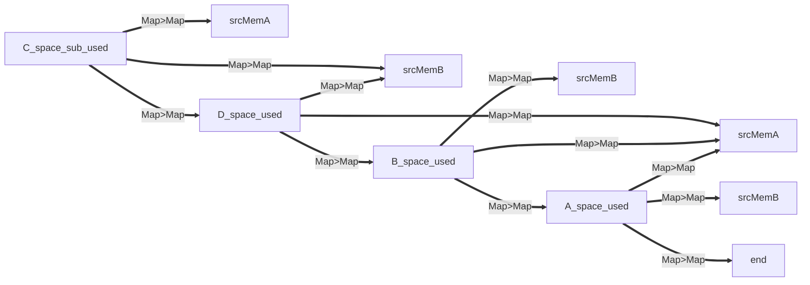

# easily-openJCL

## 什么是 easily-openJCL

easily-openJCL 是一个轻量级的 Java 语言下的 GPU 显卡 计算库，它提供了一套简单易用的 API，让用户能够轻松实现 GPU 计算操作。

通过 Java 调用 GPU 计算的一个库，使用非常简单的API就可以轻松应付 Java 数据类型在 GPU 中的计算操作！easily-openJCL
提供了诸多中计算模式，让我们的计算组件更灵活！

## 为什么要使用 easily-openJCL

### 获取方式简单

您可以直接使用 maven 坐标来把此依赖导入到您的项目中，这是非常快速且方便有效的！下面是依赖的坐标

```xml

<dependencies>
    <dependency>
        <groupId>io.github.BeardedManZhao</groupId>
        <artifactId>easily-openJCL</artifactId>
        <version>1.0.4</version>
    </dependency>
</dependencies>
```

### 非常简单的使用

您无需关注一些底层的显存调用，且内置了一些计算内核，若这些已有的计算内核能够满足您，您甚至都不需要去关心计算的实现！下面是一个简单且通用的示例，将两个数组对应元素进行乘法计算，实例中有详细的注释，应该可以让您了解如何使用 `easilyOpenJCL`!

> 值得注意的是 `easilyOpenJCL.calculate` 操作并不会检查您的参数是否符合要求，因为并不是所有的计算模式都必须要满足
> 操作数的长度相同 的前提！

```java
import io.github.BeardedManZhao.easilyJopenCL.EasilyOpenJCL;
import io.github.BeardedManZhao.easilyJopenCL.kernel.KernelSource;

import java.util.Arrays;

public class Main {
    public static void main(String[] args) {
        // 准备一个 显卡计算组件！ 在其中的结尾部分加上我们要使用的计算模式
        final EasilyOpenJCL easilyOpenJCL = EasilyOpenJCL.initOpenCLEnvironment(
                // 在这里我们要做的就是为计算器装载内核，每个内核就是一种计算模式，计算组件装载了哪种模式 它就可以使用哪种计算模式。
                // 计算模式的名称格式为 "第一个操作数_操作类型_第二个操作数_操作数类型"
                // 例如第一个就是 两个float数组进行对应元素求和
                KernelSource.ARRAY_ADD_ARRAY_FLOAT,
                // 第二个就是 float数组和float数 进行对应元素求和（注意这里不是数组，是数）
                KernelSource.ARRAY_ADD_NUMBER_FLOAT
        );

        // 判断是否已经释放 如果没有释放才可以继续操作
        if (easilyOpenJCL.isNotReleased()) {
            // 准备数据 前两个是操作数 第三个是结果存储容器数组
            float[] srcArrayA = new float[]{1, 2, 3, 4, 5, 6, 7, 8, 9, 10};
            float[] srcArrayB = new float[]{1, 2, 3, 4, 5, 6, 7, 8, 9, 10};
            float[] dstArray = new float[srcArrayA.length];

            // 开始计算 在这里我们要指定好模式！
            easilyOpenJCL.calculate(srcArrayA, srcArrayB, dstArray, KernelSource.ARRAY_ADD_ARRAY_FLOAT);
            // 计算结果
            System.out.println(Arrays.toString(dstArray));
        }

        // 最后释放 值得一提的是 easilyOpenJCL 在没有释放前，calculate 函数可以无限次的调用
        easilyOpenJCL.releaseResources();
    }
}
```

## 更加详细的文档

您可以在这个章节中了解到更详细的文档哦~~~ 其中介绍了计算模式，介绍了自定义实现计算内核等知识！

### 繁多的内置计算模式

我们提供了一些常见的内置计算模式，我们可以通过这些模式实现有效的数据计算操作，接下来的表格中详细介绍了不同的计算模式信息！

| 计算模式名称                                               | 计算模式支持版本 | 操作数长度规则      | 计算组件解释                       |
|------------------------------------------------------|----------|--------------|------------------------------|
| KernelSource.ARRAY_ADD_ARRAY_INT                     | v1.0.3   | 两个操作数一致      | 两个 char2 数组之间进行加法计算          |
| KernelSource.ARRAY_ADD_ARRAY_INT                     | v1.0     | 两个操作数一致      | 两个 int 数组之间进行加法计算            |
| KernelSource.ARRAY_SUB_ARRAY_INT                     | v1.0     | 两个操作数一致      | 两个 int 数组之间进行减法计算            |
| KernelSource.ARRAY_MUL_ARRAY_INT                     | v1.0     | 两个操作数一致      | 两个 int 数组之间进行乘法计算            |
| KernelSource.ARRAY_DIV_ARRAY_INT                     | v1.0     | 两个操作数一致      | 两个 int 数组之间进行除法计算            |
| KernelSource.ARRAY_LS_ARRAY_INT                      | v1.0     | 两个操作数一致      | 两个 int 数组之间进行左移计算            |
| KernelSource.ARRAY_RS_ARRAY_INT                      | v1.0     | 两个操作数一致      | 两个 int 数组之间进行右移计算            |
| KernelSource.ARRAY_ADD_ARRAY_FLOAT                   | v1.0     | 两个操作数一致      | 两个 float 数组之间进行加法计算          |
| KernelSource.ARRAY_SUB_ARRAY_FLOAT                   | v1.0     | 两个操作数一致      | 两个 float 数组之间进行减法计算          |
| KernelSource.ARRAY_MUL_ARRAY_FLOAT                   | v1.0     | 两个操作数一致      | 两个 float 数组之间进行乘法计算          |
| KernelSource.ARRAY_DIV_ARRAY_FLOAT                   | v1.0     | 两个操作数一致      | 两个 float 数组之间进行除法计算          |
| KernelSource.ARRAY_LS_ARRAY_FLOAT                    | v1.0     | 两个操作数一致      | 两个 float 数组之间进行左移计算          |
| KernelSource.ARRAY_RS_ARRAY_FLOAT                    | v1.0     | 两个操作数一致      | 两个 float 数组之间进行右移计算          |
| KernelSource.ARRAY_ADD_ARRAY_DOUBLE                  | v1.0     | 两个操作数一致      | 两个 double 数组之间进行加法计算         |
| KernelSource.ARRAY_SUB_ARRAY_DOUBLE                  | v1.0     | 两个操作数一致      | 两个 double 数组之间进行减法计算         |
| KernelSource.ARRAY_MUL_ARRAY_DOUBLE                  | v1.0     | 两个操作数一致      | 两个 double 数组之间进行乘法计算         |
| KernelSource.ARRAY_DIV_ARRAY_DOUBLE                  | v1.0     | 两个操作数一致      | 两个 double 数组之间进行除法计算         |
| KernelSource.ARRAY_LS_ARRAY_DOUBLE                   | v1.0     | 两个操作数一致      | 两个 double 数组之间进行左移计算         |
| KernelSource.ARRAY_RS_ARRAY_DOUBLE                   | v1.0     | 两个操作数一致      | 两个 double 数组之间进行右移计算         |
| KernelSource.ARRAY_ADD_NUMBER_INT                    | v1.0.3   | 第二个操作数为1个元素  | char2 数组和 char2数值 之间进行加法计算   |
| KernelSource.ARRAY_ADD_NUMBER_INT                    | v1.0     | 第二个操作数为1个元素  | int 数组和 int数值 之间进行加法计算       |
| KernelSource.ARRAY_SUB_NUMBER_INT                    | v1.0     | 第二个操作数为1个元素  | int 数组和 int数值 之间进行加法计算       |
| KernelSource.ARRAY_MUL_NUMBER_INT                    | v1.0     | 第二个操作数为1个元素  | int 数组和 int数值 之间进行加法计算       |
| KernelSource.ARRAY_DIV_NUMBER_INT                    | v1.0     | 第二个操作数为1个元素  | int 数组和 int数值 之间进行加法计算       |
| KernelSource.ARRAY_LS_NUMBER_INT                     | v1.0     | 第二个操作数为1个元素  | int 数组和 int数值 之间进行加法计算       |
| KernelSource.ARRAY_RS_NUMBER_INT                     | v1.0     | 第二个操作数为1个元素  | int 数组和 int数值 之间进行加法计算       |
| KernelSource.ARRAY_ADD_NUMBER_FLOAT                  | v1.0     | 第二个操作数为1个元素  | float 数组和 float数值 之间进行加法计算   |
| KernelSource.ARRAY_SUB_NUMBER_FLOAT                  | v1.0     | 第二个操作数为1个元素  | float 数组和 float数值 之间进行加法计算   |
| KernelSource.ARRAY_MUL_NUMBER_FLOAT                  | v1.0     | 第二个操作数为1个元素  | float 数组和 float数值 之间进行加法计算   |
| KernelSource.ARRAY_DIV_NUMBER_FLOAT                  | v1.0     | 第二个操作数为1个元素  | float 数组和 float数值 之间进行加法计算   |
| KernelSource.ARRAY_LS_NUMBER_FLOAT                   | v1.0     | 第二个操作数为1个元素  | float 数组和 float数值 之间进行加法计算   |
| KernelSource.ARRAY_RS_NUMBER_FLOAT                   | v1.0     | 第二个操作数为1个元素  | float 数组和 float数值 之间进行加法计算   |
| KernelSource.ARRAY_ADD_NUMBER_DOUBLE                 | v1.0     | 第二个操作数为1个元素  | double 数组和 double数值 之间进行加法计算 |
| KernelSource.ARRAY_SUB_NUMBER_DOUBLE                 | v1.0     | 第二个操作数为1个元素  | double 数组和 double数值 之间进行加法计算 |
| KernelSource.ARRAY_MUL_NUMBER_DOUBLE                 | v1.0     | 第二个操作数为1个元素  | double 数组和 double数值 之间进行加法计算 |
| KernelSource.ARRAY_DIV_NUMBER_DOUBLE                 | v1.0     | 第二个操作数为1个元素  | double 数组和 double数值 之间进行加法计算 |
| KernelSource.ARRAY_LS_NUMBER_DOUBLE                  | v1.0     | 第二个操作数为1个元素  | double 数组和 double数值 之间进行加法计算 |
| KernelSource.ARRAY_RS_NUMBER_DOUBLE                  | v1.0     | 第二个操作数为1个元素  | double 数组和 double数值 之间进行加法计算 |
| KernelSource.ARRAY_POW2_NULL_INT                     | v1.0.2   | 第二个操作数不需要有元素 | int 数组的所有元素进行 2幂运算           |
| KernelSource.ARRAY_POW4_NULL_INT                     | v1.0.2   | 第二个操作数不需要有元素 | int 数组的所有元素进行 4幂运算           |
| KernelSource.ARRAY_POW6_NULL_INT                     | v1.0.2   | 第二个操作数不需要有元素 | int 数组的所有元素进行 6幂运算           |
| KernelSource.ARRAY_POW8_NULL_INT                     | v1.0.2   | 第二个操作数不需要有元素 | int 数组的所有元素进行 8幂运算           |
| KernelSource.ARRAY_POW2_NULL_FLOAT                   | v1.0.2   | 第二个操作数不需要有元素 | float 数组的所有元素进行 2幂运算         |
| KernelSource.ARRAY_POW4_NULL_FLOAT                   | v1.0.2   | 第二个操作数不需要有元素 | float 数组的所有元素进行 4幂运算         |
| KernelSource.ARRAY_POW6_NULL_FLOAT                   | v1.0.2   | 第二个操作数不需要有元素 | float 数组的所有元素进行 6幂运算         |
| KernelSource.ARRAY_POW8_NULL_FLOAT                   | v1.0.2   | 第二个操作数不需要有元素 | float 数组的所有元素进行 8幂运算         |
| KernelSource.ARRAY_POW2_NULL_DOUBLE                  | v1.0.2   | 第二个操作数不需要有元素 | double 数组的所有元素进行 2幂运算        |
| KernelSource.ARRAY_POW4_NULL_DOUBLE                  | v1.0.2   | 第二个操作数不需要有元素 | double 数组的所有元素进行 4幂运算        |
| KernelSource.ARRAY_POW6_NULL_DOUBLE                  | v1.0.2   | 第二个操作数不需要有元素 | double 数组的所有元素进行 6幂运算        |
| KernelSource.ARRAY_POW8_NULL_DOUBLE                  | v1.0.2   | 第二个操作数不需要有元素 | double 数组的所有元素进行 8幂运算        |
| KernelSource.ARRAY_MAX_ARRAY_INT                     | v1.0.2   | 两个操作数一致      | 两个 int 数组的所有元素进行最大值提取        |
| KernelSource.ARRAY_MAX_ARRAY_FLOAT                   | v1.0.2   | 两个操作数一致      | 两个 float 数组的所有元素进行最大值提取      |
| KernelSource.ARRAY_MAX_ARRAY_DOUBLE                  | v1.0.2   | 两个操作数一致      | 两个 double 数组的所有元素进行最大值提取     |
| KernelSource.ARRAY_MIN_ARRAY_INT                     | v1.0.2   | 两个操作数一致      | 两个 int 数组的所有元素进行最小值提取        |
| KernelSource.ARRAY_MIN_ARRAY_FLOAT                   | v1.0.2   | 两个操作数一致      | 两个 float 数组的所有元素进行最小值提取      |
| KernelSource.ARRAY_MIN_ARRAY_DOUBLE                  | v1.0.2   | 两个操作数一致      | 两个 double 数组的所有元素进行最小值提取     |
| LengthKernelSource.ARRAY_KRONECKER_PRODUCT_ARRAY_INT | v1.0.2   | 两个操作数长度的乘积   | 两个 int 数组的所有元素的克罗内克乘积        |
| LengthKernelSource.ARRAY_KRONECKER_PRODUCT_ARRAY_INT | v1.0.2   | 两个操作数长度的乘积   | 两个 float 数组的所有元素的克罗内克乘积      |
| LengthKernelSource.ARRAY_KRONECKER_PRODUCT_ARRAY_INT | v1.0.2   | 两个操作数长度的乘积   | 两个 double 数组的所有元素的克罗内克乘积     |
| LengthKernelSource.ARRAY_ENCODE_XOR_ARRAY_CHAR2      | v1.0.3   | 大于等于1        | 对第一个操作数进行 xor 加密运算           |
| LengthKernelSource.ARRAY_DECODE_XOR_ARRAY_CHAR2      | v1.0.3   | 大于等于1        | 对第一个操作数进行 xor 解密运算           |

#### 数组与数组的计算模式

```java
import io.github.BeardedManZhao.easilyJopenCL.EasilyOpenJCL;
import io.github.BeardedManZhao.easilyJopenCL.kernel.KernelSource;

import java.util.Arrays;

public class Main {
    public static void main(String[] args) {
        // 准备一个 显卡计算组件！ 在其中的结尾部分加上我们要使用的计算模式
        final EasilyOpenJCL easilyOpenJCL = EasilyOpenJCL.initOpenCLEnvironment(
                // 计算模式 这里是 float 加法和减法
                KernelSource.ARRAY_ADD_ARRAY_FLOAT, KernelSource.ARRAY_SUB_ARRAY_FLOAT,
                // 还有 double 的乘法和除法
                KernelSource.ARRAY_MUL_ARRAY_DOUBLE, KernelSource.ARRAY_DIV_ARRAY_DOUBLE
        );

        // 判断是否已经释放 如果没有释放才可以继续操作
        if (easilyOpenJCL.isNotReleased()) {
            // 准备两个数组
            final float[] srcArrayA = new float[]{1, 2, 3, 4, 5, 6, 7, 8, 9, 10};
            final float[] srcArrayB = new float[]{10, 20, 30, 40, 50, 60, 70, 80, 90, 100};
            final float[] dstArray = new float[srcArrayA.length];
            // 直接开始 使用 ARRAY_ADD_ARRAY_FLOAT 模式计算
            easilyOpenJCL.calculate(srcArrayA, srcArrayB, dstArray, KernelSource.ARRAY_ADD_ARRAY_FLOAT);
            // 获取到结果
            System.out.println(Arrays.toString(dstArray));

            System.out.println("================");

            // 准备两个 double 数组
            final double[] srcArrayA1 = new double[]{1, 2, 3, 4, 5, 6, 7, 8, 9, 10};
            final double[] srcArrayB1 = new double[]{2, 4, 2, 4, 2, 4, 2, 4, 2, 4};
            final double[] dstArray1 = new double[srcArrayA1.length];
            // 直接开始 使用 ARRAY_MUL_ARRAY_DOUBLE 模式计算
            easilyOpenJCL.calculate(srcArrayA1, srcArrayB1, dstArray1, KernelSource.ARRAY_MUL_ARRAY_DOUBLE);
            // 获取到结果
            System.out.println(Arrays.toString(dstArray1));
        }
        // 释放组件
        easilyOpenJCL.releaseResources();
    }
}
```

下面是计算结果

```
[11.0, 22.0, 33.0, 44.0, 55.0, 66.0, 77.0, 88.0, 99.0, 110.0]
================
[2.0, 8.0, 6.0, 16.0, 10.0, 24.0, 14.0, 32.0, 18.0, 40.0]
```

#### 数组与数值的计算模式

```java
import io.github.BeardedManZhao.easilyJopenCL.EasilyOpenJCL;
import io.github.BeardedManZhao.easilyJopenCL.kernel.KernelSource;

import java.util.Arrays;

public class Main {
    public static void main(String[] args) {
        // 准备一个 显卡计算组件！ 在其中的结尾部分加上我们要使用的计算模式
        final EasilyOpenJCL easilyOpenJCL = EasilyOpenJCL.initOpenCLEnvironment(
                // 计算模式 这里是 float 加法和减法
                KernelSource.ARRAY_ADD_NUMBER_FLOAT, KernelSource.ARRAY_SUB_NUMBER_FLOAT,
                // 还有 double 的乘法和除法
                KernelSource.ARRAY_MUL_NUMBER_DOUBLE, KernelSource.ARRAY_DIV_NUMBER_DOUBLE
        );

        // 判断是否已经释放 如果没有释放才可以继续操作
        if (easilyOpenJCL.isNotReleased()) {
            // 准备两个 float 数组 第二个整形数组只有一个元素 因为 ARRAY_ADD_NUMBER_* 模式代表的就是 数组和一个元素进行 ADD 计算
            // 这里代表 srcArrayA 的元素 每个都加 10
            final float[] srcArrayA = new float[]{1, 2, 3, 4, 5, 6, 7, 8, 9, 10};
            final float[] srcArrayB = new float[]{10};
            final float[] dstArray = new float[srcArrayA.length];
            // 直接开始 使用 ARRAY_ADD_NUMBER_FLOAT 模式计算
            easilyOpenJCL.calculate(srcArrayA, srcArrayB, dstArray, KernelSource.ARRAY_ADD_NUMBER_FLOAT);
            // 获取到结果
            System.out.println(Arrays.toString(dstArray));

            System.out.println("================");

            // 准备两个 double 数组 第二个整形数组只有一个元素 因为 ARRAY_MUL_NUMBER_* 模式代表的就是 数组和一个元素进行 MUL 计算
            // 这里代表 srcArrayA1 的元素 每个都乘 2
            final double[] srcArrayA1 = new double[]{1, 2, 3, 4, 5, 6, 7, 8, 9, 10};
            final double[] srcArrayB1 = new double[]{2};
            final double[] dstArray1 = new double[srcArrayA1.length];
            // 直接开始 使用 ARRAY_MUL_NUMBER_DOUBLE 模式计算
            easilyOpenJCL.calculate(srcArrayA1, srcArrayB1, dstArray1, KernelSource.ARRAY_MUL_NUMBER_DOUBLE);
            // 获取到结果
            System.out.println(Arrays.toString(dstArray1));
        }
        // 释放组件
        easilyOpenJCL.releaseResources();
    }
}
```

下面是计算结果

```
[11.0, 12.0, 13.0, 14.0, 15.0, 16.0, 17.0, 18.0, 19.0, 20.0]
================
[2.0, 4.0, 6.0, 8.0, 10.0, 12.0, 14.0, 16.0, 18.0, 20.0]
```

### 自定义计算模式

```java
import io.github.BeardedManZhao.easilyJopenCL.EasilyOpenJCL;
import io.github.BeardedManZhao.easilyJopenCL.kernel.KernelSource;

import java.util.Arrays;

public class Main {
    public static void main(String[] args) {
        // 自定义的实现一个计算模式
        final KernelSource kernelSourceUDF = new KernelSource(
                // args1[0]=数组1的引用对象  args1[1]=数组2的引用对象  args1[2]=当前计算操作位于的索引  args1[3]=结果数组的引用对象
                // 这里是 结果数组[0] = 数组1[i] + 数组2[i] + 1
                // 第二个参数代表的是该计算模式 可计算的类型为 int
                // 第三个参数代表的是该计算模式的名称
                args1 -> String.format("%s[%s] = %s[%s] + %s[%s] + 1;", args1[3], args1[2], args1[0], args1[2], args1[1], args1[2]), "int", "MyUdfModel"
        );

        // 准备一个 显卡计算组件！ 在其中的结尾部分加上我们要使用的计算模式
        final EasilyOpenJCL easilyOpenJCL = EasilyOpenJCL.initOpenCLEnvironment(
                // 在这里我们直接将自己实现的计算组件传递进来
                kernelSourceUDF
        );

        // 判断是否已经释放 如果没有释放才可以继续操作
        if (easilyOpenJCL.isNotReleased()) {
            // 这里代表 srcArrayA 和 srcArrayB 的相同索引元素相加 最后加1 实现赋值操作
            final int[] srcArrayA = new int[]{1, 2, 3, 4, 5, 6, 7, 8, 9, 10};
            final int[] srcArrayB = new int[]{1, 2, 3, 4, 5, 6, 7, 8, 9, 11};
            final int[] dstArray = new int[srcArrayA.length];
            // 直接开始 使用我们自己实现的 kernelSourceUDF 模式计算
            easilyOpenJCL.calculate(srcArrayA, srcArrayB, dstArray, kernelSourceUDF);
            // 获取到结果
            System.out.println(Arrays.toString(dstArray));
        }
        // 释放组件
        easilyOpenJCL.releaseResources();
    }
}
```

这是计算结果

```
[3, 5, 7, 9, 11, 13, 15, 17, 19, 22]
```

### 灵活的API

### 基本计算示例

我们在计算模式章节中，演示的都是将结果存储到已经存在的数组中，实际上，您可以不去将结果存储到已经存在的数组中，而是通过回调函数直接调用内存映射过来的
byteBuffer，下面是一个示例！

```java
import io.github.BeardedManZhao.easilyJopenCL.EasilyOpenJCL;
import io.github.BeardedManZhao.easilyJopenCL.kernel.KernelSource;

public class Main {
    public static void main(String[] args0) {
        final EasilyOpenJCL easilyOpenJCL = EasilyOpenJCL.initOpenCLEnvironment(
                KernelSource.ARRAY_ADD_ARRAY_INT
        );
        // 准备两个数组
        final int[] srcArrayA = new int[]{1, 2, 3, 4, 5, 6, 7, 8, 9, 10, 11, 12, 13, 14, 15, 16, 17, 18, 19, 20, 21, 22, 23, 24, 25, 26, 27, 28, 29, 30, 31, 32, 33, 34, 35, 36, 37};
        final int[] srcArrayB = {100, 200, 300, 400, 500, 600, 700, 800, 900, 1000, 1100, 1200, 1300, 1400, 1500, 1600, 1700, 1800, 1900, 2000, 2100, 2200, 2300, 2400, 2500, 2600, 2700, 2800, 2900, 3000, 3100, 3200, 3300, 3400, 3500, 3600, 3700};
        // 直接将两个数组进行求和计算 值得一提的是 我们没有准备结果数组的容器 而是直接在回调中将其打印了出来
        easilyOpenJCL.calculate(srcArrayA, srcArrayB, (result) -> {
            for (int i = 0; i < srcArrayA.length; i++) {
                // 值得注意的是，在这里由于我们是直接操作的内存，一个 int 数值占4个字节，所以 i * 4 才可以获取到正确的结果 因为 每 4 个字节读取一次 正好读取到下一个数值
                System.out.println(result.getInt(i * 4));
            }
        }, srcArrayA.length, KernelSource.ARRAY_ADD_ARRAY_INT);
    }
}
```

### 内存复用计算示例

当我们进行计算的时候，内部会进行一个内存映射的操作，这个操作是有开销的，每次计算都需要一次映射，这是很大的开销，因此很有必要复用内存，下面是一个示例！

```java
import io.github.BeardedManZhao.easilyJopenCL.EasilyOpenJCL;
import io.github.BeardedManZhao.easilyJopenCL.MemSpace;
import io.github.BeardedManZhao.easilyJopenCL.kernel.KernelSource;
import io.github.BeardedManZhao.easilyJopenCL.kernel.LengthKernelSource;
import org.jocl.Pointer;
import org.jocl.Sizeof;

public class Main {

    static final EasilyOpenJCL easilyOpenJCL = EasilyOpenJCL.initOpenCLEnvironment(
            LengthKernelSource.ARRAY_KRONECKER_PRODUCT_ARRAY_INT,
            KernelSource.ARRAY_ADD_NUMBER_INT
    );
    // 准备两个数组
    static final int[] srcArrayA = new int[]{1, 2, 3, 4, 5, 6, 7, 8, 9};
    static final int[] srcArrayB = {2, 9, 8};

    public static void main(String[] args0) {
        final int i = srcArrayA.length * srcArrayB.length;
        // 构造内存空间 并在这里指定要使用的计算内核
        final MemSpace memSpace = easilyOpenJCL.createMemSpace(
                // 这里是两个操作数的指针
                Pointer.to(srcArrayA), Pointer.to(srcArrayB),
                // 这里是两个操作数的长度 以及结果的长度（如果需要复用，则这里需要使用最大空间，为了避免申请的内存空间不够导致无法进行计算）
                srcArrayA.length, srcArrayB.length, i,
                // 这里第一个参数是操作数中元素的字节尺寸
                // 第二个是本内存空间要使用的计算模式（后期可改）
                Sizeof.cl_int, LengthKernelSource.ARRAY_KRONECKER_PRODUCT_ARRAY_INT
        );

        // 开始计算 第一个参数是结果的长度，第二个参数是内存空间对象
        f(i, memSpace);

        // 如果我们期望复用这个内存空间，那么我们不需要释放它 继续切换计算模式即可 这样就实现了复用的效果 避免了内存拷贝的开销
        memSpace.setKernelSource(KernelSource.ARRAY_ADD_NUMBER_INT);
        System.out.println("\n已切换计算模式为 " + memSpace.getKernelSource());

        // 再次计算 （由于这次我们使用的是 add 计算 数组长度不是 srcArrayA.length * srcArrayB.length 是 srcArrayA.length）
        f(srcArrayA.length, memSpace);

        // 最后释放
        memSpace.releaseResources();
        easilyOpenJCL.releaseResources();
    }

    public static void f(int len, MemSpace memSpace) {
        easilyOpenJCL.calculate(byteBuffer -> {
            for (int i = 0; i < len; i++) {
                System.out.print(byteBuffer.getInt(i * 4) + " ");
            }
        }, memSpace, false);
    }
}

```

### 内存空间合并计算

我们意识到 内存空间对象存储了操作数，可以修改计算模式复用内存空间，但是，如果我们期望修改操作数呢？

我们在内存空间对象中，提供了一个 `merge`
的函数，这个函数可以有效的将一个内存空间和一个数组进行合并操作，这个操作中会将内存进行引用复制，不会有拷贝，这样我们可以使用合并的新的内存空间进行计算，就实现了内存复用！

值得注意的是，我们合并之后和之前的内存空间一定会有共用的内存空间，因此若使用到这两个内存空间对象其中之一，则两个都不可以释放，因此，我们建议您使用合并后的内存空间进行计算，然后释放合并前的内存空间即可！

下面是一个操作示例！

```java
import io.github.BeardedManZhao.easilyJopenCL.EasilyOpenJCL;
import io.github.BeardedManZhao.easilyJopenCL.MemSpace;
import io.github.BeardedManZhao.easilyJopenCL.kernel.KernelSource;
import io.github.BeardedManZhao.easilyJopenCL.kernel.LengthKernelSource;
import org.jocl.Pointer;
import org.jocl.Sizeof;

public class Main {

    static final EasilyOpenJCL easilyOpenJCL = EasilyOpenJCL.initOpenCLEnvironment(
            LengthKernelSource.ARRAY_KRONECKER_PRODUCT_ARRAY_INT,
            KernelSource.ARRAY_ADD_NUMBER_INT
    );
    // 准备两个数组
    static final int[] srcArrayA = new int[]{1, 2, 3, 4, 5, 6, 7, 8, 9};
    static final int[] srcArrayB = {2, 9, 8};

    public static void main(String[] args0) {
        final int i = srcArrayA.length * srcArrayB.length;
        final MemSpace memSpace = easilyOpenJCL.createMemSpace(
                Pointer.to(srcArrayA), Pointer.to(srcArrayB),
                srcArrayA.length, srcArrayB.length, i,
                Sizeof.cl_int, LengthKernelSource.ARRAY_KRONECKER_PRODUCT_ARRAY_INT
        );

        // 开始计算 第一个参数是结果的长度，第二个参数是内存空间对象
        f(i, memSpace);

        // 如果我们期望复用这个内存空间，但其中 srcArrayB 需要被修改 则可以使用合并的方式获取到一个新的内存空间
        final MemSpace merge = memSpace.merge(
                // 在这里我们将第一个参数设置为 null 则代表 第一个操作数使用 memSpace 中的数据
                // 第二个参数是 srcArrayB 我们在这里进行了设置 第二个操作数使用我们提供的
                null, Pointer.to(new int[]{2, 4, 6}),
                // 第三个参数是 第一个操作数的长度
                // 第四个参数是 第二个操作数的长度
                // 第五个参数是 结果的长度
                -1, 3, srcArrayA.length * 3
        );

        System.out.println("\n合并之后");

        // 再次计算 (这次我们使用 merge 即可！)
        f(i, merge);

        // 最后释放 merge 即可，merge 会链式的将 memSpace 的资源释放掉
        merge.releaseResources();

        // 查看是否释放完毕
        System.out.println("\n释放之后");
        System.out.println(merge.isNotRelease());
        System.out.println(memSpace.isNotRelease());

        easilyOpenJCL.releaseResources();
    }

    public static void f(int len, MemSpace memSpace) {
        easilyOpenJCL.calculate(byteBuffer -> {
            for (int i = 0; i < len; i++) {
                System.out.print(byteBuffer.getInt(i * 4) + " ");
            }
        }, memSpace, false);
    }
}
```

## 测试案例

### 基准测试

> 下面是一个数学表达式计算的基准测试示例，当 CPU 的计算量足够庞大的时候，GPU 的运算速度会远高于 CPU 的运算速度，但是当 CPU
> 的运算量足够小的时候，GPU 的运算速度会远低于 CPU 的运算速度。在不同电脑上，运算速度也会有差异，您可以尝试修改下面的数学表达式，来增大或减小
> CPU 和 GPU 的计算量！
> 但不论如何，您增加数学表达式的复杂度的时候，CPU的运算速度会增加，然而GPU的运算速度几乎不会增加，这是因为 GPU 的并行计算。

#### 使用数组运算

这样的操作会涉及到一些数据拷贝开销！

```java
import io.github.BeardedManZhao.easilyJopenCL.EasilyOpenJCL;
import io.github.BeardedManZhao.easilyJopenCL.kernel.KernelSource;

public class Main {
    public static void main(String[] args0) {
        // 这个地方的数学表达式 以及下面 for 循环中的 数学表达式 都是相同的，只是为了测试GPU 和 CPU 的计算差异，这个表达式越复杂 计算量就会越大，但数据拷贝量不会有变化，这可能会让 CPU 处于劣势
        final KernelSource kernelSource = new KernelSource(args -> "c[gid] = ((a[gid] / b[0] * a[0] + (a[gid] / 100 * 33 + 210.5 / 5)) * 2) * 2 / 3 + (a[gid] * a[gid] - (a[gid] * a[gid] - (a[gid] * a[gid] - (a[gid] * a[gid] - 1024)))) * ((a[gid] / b[0] * a[0] + (a[gid] / 100 * 33 + 210.5 / 5)) * 2) * 2 / 3 + (a[gid] * a[gid] - (a[gid] * a[gid] - (a[gid] * a[gid] - (a[gid] * a[gid] - 1024)))) + ((a[gid] / b[0] * a[0] + (a[gid] / 100 * 33 + 210.5 / 5)) * 2) * 2 / 3 + (a[gid] * a[gid] - (a[gid] * a[gid] - (a[gid] * a[gid] - (a[gid] * a[gid] - 1024)))) * ((a[gid] / b[0] * a[0] + (a[gid] / 100 * 33 + 210.5 / 5)) * 2) * 2 / 3 + (a[gid] * a[gid] - (a[gid] * a[gid] - (a[gid] * a[gid] - (a[gid] * a[gid] - 1024)))) + ((a[gid] / b[0] * a[0] + (a[gid] / 100 * 33 + 210.5 / 5)) * 2) * 2 / 3 + (a[gid] * a[gid] - (a[gid] * a[gid] - (a[gid] * a[gid] - (a[gid] * a[gid] - 1024)))) * ((a[gid] / b[0] * a[0] + (a[gid] / 100 * 33 + 210.5 / 5)) * 2) * 2 / 3 + (a[gid] * a[gid] - (a[gid] * a[gid] - (a[gid] * a[gid] - (a[gid] * a[gid] - 1024)))) + ((a[gid] / b[0] * a[0] + (a[gid] / 100 * 33 + 210.5 / 5)) * 2) * 2 / 3 + (a[gid] * a[gid] - (a[gid] * a[gid] - (a[gid] * a[gid] - (a[gid] * a[gid] - 1024)))) * ((a[gid] / b[0] * a[0] + (a[gid] / 100 * 33 + 210.5 / 5)) * 2) * 2 / 3 + (a[gid] * a[gid] - (a[gid] * a[gid] - (a[gid] * a[gid] - (a[gid] * a[gid] - (1024 * a[gid]))))) - ((a[gid] / b[0] * a[0] + (a[gid] / 100 * 33 + 210.5 / 5)) * 2) * 2 / 3 + (a[gid] * a[gid] - (a[gid] * a[gid] - (a[gid] * a[gid] - (a[gid] * a[gid] - 1024)))) * ((a[gid] / b[0] * a[0] + (a[gid] / 100 * 33 + 210.5 / 5)) * 2) * 2 / 3 + (a[gid] * a[gid] - (a[gid] * a[gid] - (a[gid] * a[gid] - (a[gid] * a[gid] - 1024)))) + ((a[gid] / b[0] * a[0] + (a[gid] / 100 * 33 + 210.5 / 5)) * 2) * 2 / 3 + (a[gid] * a[gid] - (a[gid] * a[gid] - (a[gid] * a[gid] - (a[gid] * a[gid] - 1024)))) * ((a[gid] / b[0] * a[0] + (a[gid] / 100 * 33 + 210.5 / 5)) * 2) * 2 / 3 + (a[gid] * a[gid] - (a[gid] * a[gid] - (a[gid] * a[gid] - (a[gid] * a[gid] - 1024)))) + ((a[gid] / b[0] * a[0] + (a[gid] / 100 * 33 + 210.5 / 5)) * 2) * 2 / 3 + (a[gid] * a[gid] - (a[gid] * a[gid] - (a[gid] * a[gid] - (a[gid] * a[gid] - 1024)))) * ((a[gid] / b[0] * a[0] + (a[gid] / 100 * 33 + 210.5 / 5)) * 2) * 2 / 3 + (a[gid] * a[gid] - (a[gid] * a[gid] - (a[gid] * a[gid] - (a[gid] * a[gid] - 1024)))) + ((a[gid] / b[0] * a[0] + (a[gid] / 100 * 33 + 210.5 / 5)) * 2) * 2 / 3 + (a[gid] * a[gid] - (a[gid] * a[gid] - (a[gid] * a[gid] - (a[gid] * a[gid] - 1024)))) * ((a[gid] / b[0] * a[0] + (a[gid] / 100 * 33 + 210.5 / 5)) * 2) * 2 / 3 + (a[gid] * a[gid] - (a[gid] * a[gid] - (a[gid] * a[gid] - (a[gid] * a[gid] - (1024 * a[gid]))))) + 1;", "double", "MY");
        final EasilyOpenJCL easilyOpenJCL = EasilyOpenJCL.initOpenCLEnvironment(
                kernelSource
        );
        // 这个数组的长度代表的是操作数的数据量 这个数值越大 计算量会成倍增大，同时数据拷贝量也会成倍增加，这将会让 GPU 计算处于劣势
        final double[] a = new double[Integer.MAX_VALUE >> 7];
        for (int i = 0; i < a.length; i++) {
            a[i] = i + 10;
        }
        final double[] b = {2};
        final double[] c = new double[a.length];

        // 热身
        easilyOpenJCL.calculate(a, b, c, kernelSource);

        // 正式计算
        final long l = System.currentTimeMillis();
        easilyOpenJCL.calculate(a, b, c, kernelSource);
        final long l1 = System.currentTimeMillis();
        System.out.println("GPU计算耗时：" + (l1 - l) + " 第一个元素结果 = " + c[0]);

        for (int gid = 0; gid < a.length; gid++) {
            c[gid] = ((a[gid] / b[0] * a[0] + (a[gid] / 100 * 33 + 210.5 / 5)) * 2) * 2 / 3 + (a[gid] * a[gid] - (a[gid] * a[gid] - (a[gid] * a[gid] - (a[gid] * a[gid] - 1024)))) * ((a[gid] / b[0] * a[0] + (a[gid] / 100 * 33 + 210.5 / 5)) * 2) * 2 / 3 + (a[gid] * a[gid] - (a[gid] * a[gid] - (a[gid] * a[gid] - (a[gid] * a[gid] - 1024)))) + ((a[gid] / b[0] * a[0] + (a[gid] / 100 * 33 + 210.5 / 5)) * 2) * 2 / 3 + (a[gid] * a[gid] - (a[gid] * a[gid] - (a[gid] * a[gid] - (a[gid] * a[gid] - 1024)))) * ((a[gid] / b[0] * a[0] + (a[gid] / 100 * 33 + 210.5 / 5)) * 2) * 2 / 3 + (a[gid] * a[gid] - (a[gid] * a[gid] - (a[gid] * a[gid] - (a[gid] * a[gid] - 1024)))) + ((a[gid] / b[0] * a[0] + (a[gid] / 100 * 33 + 210.5 / 5)) * 2) * 2 / 3 + (a[gid] * a[gid] - (a[gid] * a[gid] - (a[gid] * a[gid] - (a[gid] * a[gid] - 1024)))) * ((a[gid] / b[0] * a[0] + (a[gid] / 100 * 33 + 210.5 / 5)) * 2) * 2 / 3 + (a[gid] * a[gid] - (a[gid] * a[gid] - (a[gid] * a[gid] - (a[gid] * a[gid] - 1024)))) + ((a[gid] / b[0] * a[0] + (a[gid] / 100 * 33 + 210.5 / 5)) * 2) * 2 / 3 + (a[gid] * a[gid] - (a[gid] * a[gid] - (a[gid] * a[gid] - (a[gid] * a[gid] - 1024)))) * ((a[gid] / b[0] * a[0] + (a[gid] / 100 * 33 + 210.5 / 5)) * 2) * 2 / 3 + (a[gid] * a[gid] - (a[gid] * a[gid] - (a[gid] * a[gid] - (a[gid] * a[gid] - (1024 * a[gid]))))) - ((a[gid] / b[0] * a[0] + (a[gid] / 100 * 33 + 210.5 / 5)) * 2) * 2 / 3 + (a[gid] * a[gid] - (a[gid] * a[gid] - (a[gid] * a[gid] - (a[gid] * a[gid] - 1024)))) * ((a[gid] / b[0] * a[0] + (a[gid] / 100 * 33 + 210.5 / 5)) * 2) * 2 / 3 + (a[gid] * a[gid] - (a[gid] * a[gid] - (a[gid] * a[gid] - (a[gid] * a[gid] - 1024)))) + ((a[gid] / b[0] * a[0] + (a[gid] / 100 * 33 + 210.5 / 5)) * 2) * 2 / 3 + (a[gid] * a[gid] - (a[gid] * a[gid] - (a[gid] * a[gid] - (a[gid] * a[gid] - 1024)))) * ((a[gid] / b[0] * a[0] + (a[gid] / 100 * 33 + 210.5 / 5)) * 2) * 2 / 3 + (a[gid] * a[gid] - (a[gid] * a[gid] - (a[gid] * a[gid] - (a[gid] * a[gid] - 1024)))) + ((a[gid] / b[0] * a[0] + (a[gid] / 100 * 33 + 210.5 / 5)) * 2) * 2 / 3 + (a[gid] * a[gid] - (a[gid] * a[gid] - (a[gid] * a[gid] - (a[gid] * a[gid] - 1024)))) * ((a[gid] / b[0] * a[0] + (a[gid] / 100 * 33 + 210.5 / 5)) * 2) * 2 / 3 + (a[gid] * a[gid] - (a[gid] * a[gid] - (a[gid] * a[gid] - (a[gid] * a[gid] - 1024)))) + ((a[gid] / b[0] * a[0] + (a[gid] / 100 * 33 + 210.5 / 5)) * 2) * 2 / 3 + (a[gid] * a[gid] - (a[gid] * a[gid] - (a[gid] * a[gid] - (a[gid] * a[gid] - 1024)))) * ((a[gid] / b[0] * a[0] + (a[gid] / 100 * 33 + 210.5 / 5)) * 2) * 2 / 3 + (a[gid] * a[gid] - (a[gid] * a[gid] - (a[gid] * a[gid] - (a[gid] * a[gid] - (1024 * a[gid]))))) + 1;
        }
        final long l2 = System.currentTimeMillis();
        System.out.println("CPU计算耗时：" + (l2 - l1) + " 第一个元素结果 = " + c[0]);
    }
}
```

#### 只有结果使用内存空间 操作数使用数组

从显存到物理内存之间几乎不存在数据拷贝，其效率比上面的要高!

```java
import io.github.BeardedManZhao.easilyJopenCL.EasilyOpenJCL;
import io.github.BeardedManZhao.easilyJopenCL.kernel.KernelSource;

public class Main {
    public static void main(String[] args0) {
        // 这个地方的数学表达式 以及下面 for 循环中的 数学表达式 都是相同的，只是为了测试GPU 和 CPU 的计算差异，这个表达式越复杂 计算量就会越大，但数据拷贝量不会有变化，这可能会让 CPU 处于劣势
        final KernelSource kernelSource = new KernelSource(args -> "c[gid] = ((a[gid] / b[0] * a[0] + (a[gid] / 100 * 33 + 210.5 / 5)) * 2) * 2 / 3 + (a[gid] * a[gid] - (a[gid] * a[gid] - (a[gid] * a[gid] - (a[gid] * a[gid] - 1024)))) * ((a[gid] / b[0] * a[0] + (a[gid] / 100 * 33 + 210.5 / 5)) * 2) * 2 / 3 + (a[gid] * a[gid] - (a[gid] * a[gid] - (a[gid] * a[gid] - (a[gid] * a[gid] - 1024)))) + ((a[gid] / b[0] * a[0] + (a[gid] / 100 * 33 + 210.5 / 5)) * 2) * 2 / 3 + (a[gid] * a[gid] - (a[gid] * a[gid] - (a[gid] * a[gid] - (a[gid] * a[gid] - 1024)))) * ((a[gid] / b[0] * a[0] + (a[gid] / 100 * 33 + 210.5 / 5)) * 2) * 2 / 3 + (a[gid] * a[gid] - (a[gid] * a[gid] - (a[gid] * a[gid] - (a[gid] * a[gid] - 1024)))) + ((a[gid] / b[0] * a[0] + (a[gid] / 100 * 33 + 210.5 / 5)) * 2) * 2 / 3 + (a[gid] * a[gid] - (a[gid] * a[gid] - (a[gid] * a[gid] - (a[gid] * a[gid] - 1024)))) * ((a[gid] / b[0] * a[0] + (a[gid] / 100 * 33 + 210.5 / 5)) * 2) * 2 / 3 + (a[gid] * a[gid] - (a[gid] * a[gid] - (a[gid] * a[gid] - (a[gid] * a[gid] - 1024)))) + ((a[gid] / b[0] * a[0] + (a[gid] / 100 * 33 + 210.5 / 5)) * 2) * 2 / 3 + (a[gid] * a[gid] - (a[gid] * a[gid] - (a[gid] * a[gid] - (a[gid] * a[gid] - 1024)))) * ((a[gid] / b[0] * a[0] + (a[gid] / 100 * 33 + 210.5 / 5)) * 2) * 2 / 3 + (a[gid] * a[gid] - (a[gid] * a[gid] - (a[gid] * a[gid] - (a[gid] * a[gid] - (1024 * a[gid]))))) - ((a[gid] / b[0] * a[0] + (a[gid] / 100 * 33 + 210.5 / 5)) * 2) * 2 / 3 + (a[gid] * a[gid] - (a[gid] * a[gid] - (a[gid] * a[gid] - (a[gid] * a[gid] - 1024)))) * ((a[gid] / b[0] * a[0] + (a[gid] / 100 * 33 + 210.5 / 5)) * 2) * 2 / 3 + (a[gid] * a[gid] - (a[gid] * a[gid] - (a[gid] * a[gid] - (a[gid] * a[gid] - 1024)))) + ((a[gid] / b[0] * a[0] + (a[gid] / 100 * 33 + 210.5 / 5)) * 2) * 2 / 3 + (a[gid] * a[gid] - (a[gid] * a[gid] - (a[gid] * a[gid] - (a[gid] * a[gid] - 1024)))) * ((a[gid] / b[0] * a[0] + (a[gid] / 100 * 33 + 210.5 / 5)) * 2) * 2 / 3 + (a[gid] * a[gid] - (a[gid] * a[gid] - (a[gid] * a[gid] - (a[gid] * a[gid] - 1024)))) + ((a[gid] / b[0] * a[0] + (a[gid] / 100 * 33 + 210.5 / 5)) * 2) * 2 / 3 + (a[gid] * a[gid] - (a[gid] * a[gid] - (a[gid] * a[gid] - (a[gid] * a[gid] - 1024)))) * ((a[gid] / b[0] * a[0] + (a[gid] / 100 * 33 + 210.5 / 5)) * 2) * 2 / 3 + (a[gid] * a[gid] - (a[gid] * a[gid] - (a[gid] * a[gid] - (a[gid] * a[gid] - 1024)))) + ((a[gid] / b[0] * a[0] + (a[gid] / 100 * 33 + 210.5 / 5)) * 2) * 2 / 3 + (a[gid] * a[gid] - (a[gid] * a[gid] - (a[gid] * a[gid] - (a[gid] * a[gid] - 1024)))) * ((a[gid] / b[0] * a[0] + (a[gid] / 100 * 33 + 210.5 / 5)) * 2) * 2 / 3 + (a[gid] * a[gid] - (a[gid] * a[gid] - (a[gid] * a[gid] - (a[gid] * a[gid] - (1024 * a[gid]))))) + 1;", "double", "MY");
        final EasilyOpenJCL easilyOpenJCL = EasilyOpenJCL.initOpenCLEnvironment(
                kernelSource
        );
        // 这个数组的长度代表的是操作数的数据量 这个数值越大 计算量会成倍增大，同时数据拷贝量也会成倍增加，这将会让 GPU 计算处于劣势
        final double[] a = new double[Integer.MAX_VALUE >> 7];
        for (int i = 0; i < a.length; i++) {
            a[i] = i + 10;
        }
        final double[] b = {2};
        final double[] c = new double[a.length];

        // 热身
        easilyOpenJCL.calculate(a, b, c, kernelSource);

        // 正式计算
        final long l = System.currentTimeMillis();
        easilyOpenJCL.calculate(a, b, byteBuffer -> {
            final long l1 = System.currentTimeMillis();
            System.out.println("GPU计算耗时：" + (l1 - l) + " 第一个元素结果 = " + c[0]);
        }, c.length, kernelSource);

        final long l1 = System.currentTimeMillis();
        for (int gid = 0; gid < a.length; gid++) {
            c[gid] = ((a[gid] / b[0] * a[0] + (a[gid] / 100 * 33 + 210.5 / 5)) * 2) * 2 / 3 + (a[gid] * a[gid] - (a[gid] * a[gid] - (a[gid] * a[gid] - (a[gid] * a[gid] - 1024)))) * ((a[gid] / b[0] * a[0] + (a[gid] / 100 * 33 + 210.5 / 5)) * 2) * 2 / 3 + (a[gid] * a[gid] - (a[gid] * a[gid] - (a[gid] * a[gid] - (a[gid] * a[gid] - 1024)))) + ((a[gid] / b[0] * a[0] + (a[gid] / 100 * 33 + 210.5 / 5)) * 2) * 2 / 3 + (a[gid] * a[gid] - (a[gid] * a[gid] - (a[gid] * a[gid] - (a[gid] * a[gid] - 1024)))) * ((a[gid] / b[0] * a[0] + (a[gid] / 100 * 33 + 210.5 / 5)) * 2) * 2 / 3 + (a[gid] * a[gid] - (a[gid] * a[gid] - (a[gid] * a[gid] - (a[gid] * a[gid] - 1024)))) + ((a[gid] / b[0] * a[0] + (a[gid] / 100 * 33 + 210.5 / 5)) * 2) * 2 / 3 + (a[gid] * a[gid] - (a[gid] * a[gid] - (a[gid] * a[gid] - (a[gid] * a[gid] - 1024)))) * ((a[gid] / b[0] * a[0] + (a[gid] / 100 * 33 + 210.5 / 5)) * 2) * 2 / 3 + (a[gid] * a[gid] - (a[gid] * a[gid] - (a[gid] * a[gid] - (a[gid] * a[gid] - 1024)))) + ((a[gid] / b[0] * a[0] + (a[gid] / 100 * 33 + 210.5 / 5)) * 2) * 2 / 3 + (a[gid] * a[gid] - (a[gid] * a[gid] - (a[gid] * a[gid] - (a[gid] * a[gid] - 1024)))) * ((a[gid] / b[0] * a[0] + (a[gid] / 100 * 33 + 210.5 / 5)) * 2) * 2 / 3 + (a[gid] * a[gid] - (a[gid] * a[gid] - (a[gid] * a[gid] - (a[gid] * a[gid] - (1024 * a[gid]))))) - ((a[gid] / b[0] * a[0] + (a[gid] / 100 * 33 + 210.5 / 5)) * 2) * 2 / 3 + (a[gid] * a[gid] - (a[gid] * a[gid] - (a[gid] * a[gid] - (a[gid] * a[gid] - 1024)))) * ((a[gid] / b[0] * a[0] + (a[gid] / 100 * 33 + 210.5 / 5)) * 2) * 2 / 3 + (a[gid] * a[gid] - (a[gid] * a[gid] - (a[gid] * a[gid] - (a[gid] * a[gid] - 1024)))) + ((a[gid] / b[0] * a[0] + (a[gid] / 100 * 33 + 210.5 / 5)) * 2) * 2 / 3 + (a[gid] * a[gid] - (a[gid] * a[gid] - (a[gid] * a[gid] - (a[gid] * a[gid] - 1024)))) * ((a[gid] / b[0] * a[0] + (a[gid] / 100 * 33 + 210.5 / 5)) * 2) * 2 / 3 + (a[gid] * a[gid] - (a[gid] * a[gid] - (a[gid] * a[gid] - (a[gid] * a[gid] - 1024)))) + ((a[gid] / b[0] * a[0] + (a[gid] / 100 * 33 + 210.5 / 5)) * 2) * 2 / 3 + (a[gid] * a[gid] - (a[gid] * a[gid] - (a[gid] * a[gid] - (a[gid] * a[gid] - 1024)))) * ((a[gid] / b[0] * a[0] + (a[gid] / 100 * 33 + 210.5 / 5)) * 2) * 2 / 3 + (a[gid] * a[gid] - (a[gid] * a[gid] - (a[gid] * a[gid] - (a[gid] * a[gid] - 1024)))) + ((a[gid] / b[0] * a[0] + (a[gid] / 100 * 33 + 210.5 / 5)) * 2) * 2 / 3 + (a[gid] * a[gid] - (a[gid] * a[gid] - (a[gid] * a[gid] - (a[gid] * a[gid] - 1024)))) * ((a[gid] / b[0] * a[0] + (a[gid] / 100 * 33 + 210.5 / 5)) * 2) * 2 / 3 + (a[gid] * a[gid] - (a[gid] * a[gid] - (a[gid] * a[gid] - (a[gid] * a[gid] - (1024 * a[gid]))))) + 1;
        }
        final long l2 = System.currentTimeMillis();
        System.out.println("CPU计算耗时：" + (l2 - l1) + " 第一个元素结果 = " + c[0]);
    }
}
```

#### 所有操作数均使用内存空间直接运算

这样的操作的效率会比上面更高，因为这里的操作数部分，从物理内存到显存之间的拷贝也几乎消失。

```java
import io.github.BeardedManZhao.easilyJopenCL.EasilyOpenJCL;
import io.github.BeardedManZhao.easilyJopenCL.MemSpace;
import io.github.BeardedManZhao.easilyJopenCL.kernel.KernelSource;
import org.jocl.Pointer;
import org.jocl.Sizeof;

public class Main {
    public static void main(String[] args0) {
        // 这个地方的数学表达式 以及下面 for 循环中的 数学表达式 都是相同的，只是为了测试GPU 和 CPU 的计算差异，这个表达式越复杂 计算量就会越大，但数据拷贝量不会有变化，这可能会让 CPU 处于劣势
        final KernelSource kernelSource = new KernelSource(args -> "c[gid] = ((a[gid] / b[0] * a[0] + (a[gid] / 100 * 33 + 210.5 / 5)) * 2) * 2 / 3 + (a[gid] * a[gid] - (a[gid] * a[gid] - (a[gid] * a[gid] - (a[gid] * a[gid] - 1024)))) * ((a[gid] / b[0] * a[0] + (a[gid] / 100 * 33 + 210.5 / 5)) * 2) * 2 / 3 + (a[gid] * a[gid] - (a[gid] * a[gid] - (a[gid] * a[gid] - (a[gid] * a[gid] - 1024)))) + ((a[gid] / b[0] * a[0] + (a[gid] / 100 * 33 + 210.5 / 5)) * 2) * 2 / 3 + (a[gid] * a[gid] - (a[gid] * a[gid] - (a[gid] * a[gid] - (a[gid] * a[gid] - 1024)))) * ((a[gid] / b[0] * a[0] + (a[gid] / 100 * 33 + 210.5 / 5)) * 2) * 2 / 3 + (a[gid] * a[gid] - (a[gid] * a[gid] - (a[gid] * a[gid] - (a[gid] * a[gid] - 1024)))) + ((a[gid] / b[0] * a[0] + (a[gid] / 100 * 33 + 210.5 / 5)) * 2) * 2 / 3 + (a[gid] * a[gid] - (a[gid] * a[gid] - (a[gid] * a[gid] - (a[gid] * a[gid] - 1024)))) * ((a[gid] / b[0] * a[0] + (a[gid] / 100 * 33 + 210.5 / 5)) * 2) * 2 / 3 + (a[gid] * a[gid] - (a[gid] * a[gid] - (a[gid] * a[gid] - (a[gid] * a[gid] - 1024)))) + ((a[gid] / b[0] * a[0] + (a[gid] / 100 * 33 + 210.5 / 5)) * 2) * 2 / 3 + (a[gid] * a[gid] - (a[gid] * a[gid] - (a[gid] * a[gid] - (a[gid] * a[gid] - 1024)))) * ((a[gid] / b[0] * a[0] + (a[gid] / 100 * 33 + 210.5 / 5)) * 2) * 2 / 3 + (a[gid] * a[gid] - (a[gid] * a[gid] - (a[gid] * a[gid] - (a[gid] * a[gid] - (1024 * a[gid]))))) - ((a[gid] / b[0] * a[0] + (a[gid] / 100 * 33 + 210.5 / 5)) * 2) * 2 / 3 + (a[gid] * a[gid] - (a[gid] * a[gid] - (a[gid] * a[gid] - (a[gid] * a[gid] - 1024)))) * ((a[gid] / b[0] * a[0] + (a[gid] / 100 * 33 + 210.5 / 5)) * 2) * 2 / 3 + (a[gid] * a[gid] - (a[gid] * a[gid] - (a[gid] * a[gid] - (a[gid] * a[gid] - 1024)))) + ((a[gid] / b[0] * a[0] + (a[gid] / 100 * 33 + 210.5 / 5)) * 2) * 2 / 3 + (a[gid] * a[gid] - (a[gid] * a[gid] - (a[gid] * a[gid] - (a[gid] * a[gid] - 1024)))) * ((a[gid] / b[0] * a[0] + (a[gid] / 100 * 33 + 210.5 / 5)) * 2) * 2 / 3 + (a[gid] * a[gid] - (a[gid] * a[gid] - (a[gid] * a[gid] - (a[gid] * a[gid] - 1024)))) + ((a[gid] / b[0] * a[0] + (a[gid] / 100 * 33 + 210.5 / 5)) * 2) * 2 / 3 + (a[gid] * a[gid] - (a[gid] * a[gid] - (a[gid] * a[gid] - (a[gid] * a[gid] - 1024)))) * ((a[gid] / b[0] * a[0] + (a[gid] / 100 * 33 + 210.5 / 5)) * 2) * 2 / 3 + (a[gid] * a[gid] - (a[gid] * a[gid] - (a[gid] * a[gid] - (a[gid] * a[gid] - 1024)))) + ((a[gid] / b[0] * a[0] + (a[gid] / 100 * 33 + 210.5 / 5)) * 2) * 2 / 3 + (a[gid] * a[gid] - (a[gid] * a[gid] - (a[gid] * a[gid] - (a[gid] * a[gid] - 1024)))) * ((a[gid] / b[0] * a[0] + (a[gid] / 100 * 33 + 210.5 / 5)) * 2) * 2 / 3 + (a[gid] * a[gid] - (a[gid] * a[gid] - (a[gid] * a[gid] - (a[gid] * a[gid] - (1024 * a[gid]))))) + 1;", "double", "MY");
        final EasilyOpenJCL easilyOpenJCL = EasilyOpenJCL.initOpenCLEnvironment(
                kernelSource
        );
        // 这个数组的长度代表的是操作数的数据量 这个数值越大 计算量会成倍增大，同时数据拷贝量也会成倍增加，这将会让 GPU 计算处于劣势
        final double[] a = new double[Integer.MAX_VALUE >> 6];
        for (int i = 0; i < a.length; i++) {
            a[i] = i + 10;
        }
        final double[] b = {2};
        final double[] c = new double[a.length];
        // 获取到内存空间
        final MemSpace memSpace = easilyOpenJCL.createMemSpace(Pointer.to(a), Pointer.to(b), a.length, b.length, c.length, Sizeof.cl_double, kernelSource);

        // 热身
        easilyOpenJCL.calculate(a, b, c, kernelSource);

        // 正式计算
        final long l = System.currentTimeMillis();
        easilyOpenJCL.calculate(byteBuffer -> {
            final long l1 = System.currentTimeMillis();
            System.out.println("GPU计算耗时：" + (l1 - l) + " 第一个元素结果 = " + byteBuffer.getDouble(0));
        }, memSpace, true);


        final long l1 = System.currentTimeMillis();
        for (int gid = 0; gid < a.length; gid++) {
            c[gid] = ((a[gid] / b[0] * a[0] + (a[gid] / 100 * 33 + 210.5 / 5)) * 2) * 2 / 3 + (a[gid] * a[gid] - (a[gid] * a[gid] - (a[gid] * a[gid] - (a[gid] * a[gid] - 1024)))) * ((a[gid] / b[0] * a[0] + (a[gid] / 100 * 33 + 210.5 / 5)) * 2) * 2 / 3 + (a[gid] * a[gid] - (a[gid] * a[gid] - (a[gid] * a[gid] - (a[gid] * a[gid] - 1024)))) + ((a[gid] / b[0] * a[0] + (a[gid] / 100 * 33 + 210.5 / 5)) * 2) * 2 / 3 + (a[gid] * a[gid] - (a[gid] * a[gid] - (a[gid] * a[gid] - (a[gid] * a[gid] - 1024)))) * ((a[gid] / b[0] * a[0] + (a[gid] / 100 * 33 + 210.5 / 5)) * 2) * 2 / 3 + (a[gid] * a[gid] - (a[gid] * a[gid] - (a[gid] * a[gid] - (a[gid] * a[gid] - 1024)))) + ((a[gid] / b[0] * a[0] + (a[gid] / 100 * 33 + 210.5 / 5)) * 2) * 2 / 3 + (a[gid] * a[gid] - (a[gid] * a[gid] - (a[gid] * a[gid] - (a[gid] * a[gid] - 1024)))) * ((a[gid] / b[0] * a[0] + (a[gid] / 100 * 33 + 210.5 / 5)) * 2) * 2 / 3 + (a[gid] * a[gid] - (a[gid] * a[gid] - (a[gid] * a[gid] - (a[gid] * a[gid] - 1024)))) + ((a[gid] / b[0] * a[0] + (a[gid] / 100 * 33 + 210.5 / 5)) * 2) * 2 / 3 + (a[gid] * a[gid] - (a[gid] * a[gid] - (a[gid] * a[gid] - (a[gid] * a[gid] - 1024)))) * ((a[gid] / b[0] * a[0] + (a[gid] / 100 * 33 + 210.5 / 5)) * 2) * 2 / 3 + (a[gid] * a[gid] - (a[gid] * a[gid] - (a[gid] * a[gid] - (a[gid] * a[gid] - (1024 * a[gid]))))) - ((a[gid] / b[0] * a[0] + (a[gid] / 100 * 33 + 210.5 / 5)) * 2) * 2 / 3 + (a[gid] * a[gid] - (a[gid] * a[gid] - (a[gid] * a[gid] - (a[gid] * a[gid] - 1024)))) * ((a[gid] / b[0] * a[0] + (a[gid] / 100 * 33 + 210.5 / 5)) * 2) * 2 / 3 + (a[gid] * a[gid] - (a[gid] * a[gid] - (a[gid] * a[gid] - (a[gid] * a[gid] - 1024)))) + ((a[gid] / b[0] * a[0] + (a[gid] / 100 * 33 + 210.5 / 5)) * 2) * 2 / 3 + (a[gid] * a[gid] - (a[gid] * a[gid] - (a[gid] * a[gid] - (a[gid] * a[gid] - 1024)))) * ((a[gid] / b[0] * a[0] + (a[gid] / 100 * 33 + 210.5 / 5)) * 2) * 2 / 3 + (a[gid] * a[gid] - (a[gid] * a[gid] - (a[gid] * a[gid] - (a[gid] * a[gid] - 1024)))) + ((a[gid] / b[0] * a[0] + (a[gid] / 100 * 33 + 210.5 / 5)) * 2) * 2 / 3 + (a[gid] * a[gid] - (a[gid] * a[gid] - (a[gid] * a[gid] - (a[gid] * a[gid] - 1024)))) * ((a[gid] / b[0] * a[0] + (a[gid] / 100 * 33 + 210.5 / 5)) * 2) * 2 / 3 + (a[gid] * a[gid] - (a[gid] * a[gid] - (a[gid] * a[gid] - (a[gid] * a[gid] - 1024)))) + ((a[gid] / b[0] * a[0] + (a[gid] / 100 * 33 + 210.5 / 5)) * 2) * 2 / 3 + (a[gid] * a[gid] - (a[gid] * a[gid] - (a[gid] * a[gid] - (a[gid] * a[gid] - 1024)))) * ((a[gid] / b[0] * a[0] + (a[gid] / 100 * 33 + 210.5 / 5)) * 2) * 2 / 3 + (a[gid] * a[gid] - (a[gid] * a[gid] - (a[gid] * a[gid] - (a[gid] * a[gid] - (1024 * a[gid]))))) + 1;
        }
        final long l2 = System.currentTimeMillis();
        System.out.println("CPU计算耗时：" + (l2 - l1) + " 第一个元素结果 = " + c[0]);
    }
}
```

## 更新记录

### 2024-07-26 1.0.4 版本发布

- 新增了内存空间对象引用关系图的可视化操作

```java
import io.github.BeardedManZhao.easilyJopenCL.EasilyOpenJCL;
import io.github.BeardedManZhao.easilyJopenCL.NameMemSpace;
import io.github.BeardedManZhao.easilyJopenCL.kernel.LengthKernelSource;
import org.jocl.Pointer;
import org.jocl.Sizeof;
import top.lingyuzhao.varFormatter.core.VarFormatter;
import top.lingyuzhao.varFormatter.utils.DataObj;

public class Main {
    public static void main(String[] args0) {
        final EasilyOpenJCL easilyOpenJCL = EasilyOpenJCL.initOpenCLEnvironment(
                LengthKernelSource.ARRAY_DECODE_XOR_ARRAY_CHAR2,
                LengthKernelSource.ARRAY_ENCODE_XOR_ARRAY_CHAR2
        );
        // 准备两个数组 作为 A_space 空间的内存
        final char[] a = new char[10];
        final char[] b = "3009088782343454567566t57".toCharArray();
        // 将 a b 数组绑定到带名字的内存空间 A_space
        final NameMemSpace memSpace = easilyOpenJCL.createMemSpace(Pointer.to(a), Pointer.to(b), a.length, b.length, a.length, Sizeof.cl_char2, LengthKernelSource.ARRAY_ENCODE_XOR_ARRAY_CHAR2, "A_space");

        // 准备第二个数组 作为 B_space 中的内存
        final char[] d = new char[a.length];
        // 引用 A_space 中 的 a， 这里存的是其中是 a d 数组（为 null 的就代表使用原空间的引用）
        NameMemSpace merge0 = memSpace.merge(null, Pointer.to(d), -1, d.length, d.length);
        // 对合并之后的内存空间重命名为 B_space
        merge0.setMemSpaceName("B_space");

        // 准备第三个数组 作为 C_space 中的内存
        final char[] e = new char[a.length];
        // 引用 A_space 中 的 a， 这里存的是其中是 a d 数组（为 null 的就代表使用原空间的引用）
        NameMemSpace merge1 = merge0.merge(null, Pointer.to(e), -1, e.length, e.length);
        // 对合并之后的内存空间重命名为 C_space
        merge1.setMemSpaceName("C_space");

        // 准备第四个数组 作为 D_space 中的内存
        final char[] f = new char[a.length];
        // 引用 A_space 中 的 a， 这里存的是其中是 f d 数组（为 null 的就代表使用原空间的引用）
        NameMemSpace merge2 = merge1.merge(Pointer.to(f), null, f.length, -1, e.length);
        // 对合并之后的内存空间重命名为 C_space
        merge1.setMemSpaceName("D_space");

        // 尝试将第三个进行 explain
        DataObj explain = merge2.explain();
        // 直接进行绘图 图中可看到此内存空间引用的所有空间
        explain.setNameJoin(false);
        String format = VarFormatter.MERMAID.getFormatter(true).format(explain);
        System.out.println(format);
    }
}
```

下面就是生成的图，其中不同内存空间如果指向同一个 srcMem 则代表是使用的引用。



### 2024-07-14 1.0.3 版本发布

- 新增了对于 `char` 类型的计算支持

```java
import io.github.BeardedManZhao.easilyJopenCL.EasilyOpenJCL;
import io.github.BeardedManZhao.easilyJopenCL.kernel.KernelSource;
import org.jocl.Sizeof;

public class Main {
    public static void main(String[] args0) {
        // 首先准备两个字符数组
        final char[] a = "ABCD".toCharArray();
        final char[] b = "1234".toCharArray();
        // 初始化EasilyOpenJCL 在这里指定组件支持的 内核 这里指定的是将两个字符数组的对应位置的字符 ASCII 相加
        final EasilyOpenJCL easilyOpenJCL = EasilyOpenJCL.initOpenCLEnvironment(KernelSource.ARRAY_ADD_ARRAY_CHAR2);
        // 在这里开始计算，相同位置的字符进行相加，结果存放在数组 c 中 例如 ‘A’ + ‘1’ = 65 + 49 = 114 = ‘r’
        easilyOpenJCL.calculate(a, b, (byteBuffer) -> {
            for (int i = 0; i < 4; i++) {
                System.out.print(byteBuffer.getChar(i * Sizeof.cl_char2) + " ");
            }
        }, 4, KernelSource.ARRAY_ADD_ARRAY_CHAR2);
    }
}
```

- 可进行加密与解密操作

> 为了可读性，我们在这里使用的是数组方式的计算，这样的计算效率比较地下，建议实际操作中使用 内存操作！

```java
import io.github.BeardedManZhao.easilyJopenCL.EasilyOpenJCL;
import io.github.BeardedManZhao.easilyJopenCL.kernel.LengthKernelSource;

public class Main {
    public static void main(String[] args0) {
        // 首先准备两个字符数组 第一个是需要被加密的值
        final char[] a = "ABCD".toCharArray();
        // 第二个是加/解密的密钥
        final char[] b = "123".toCharArray();
        // 准备两个字符数组 用于存放加密/解密结果
        final char[] c = new char[4], d = new char[4];
        // 初始化EasilyOpenJCL 在这里指定组件支持的 内核 这里指定的是将两个字符数组的对应位置的字符 ASCII 相加
        final EasilyOpenJCL easilyOpenJCL = EasilyOpenJCL.initOpenCLEnvironment(
                LengthKernelSource.ARRAY_ENCODE_XOR_ARRAY_CHAR2,
                LengthKernelSource.ARRAY_DECODE_XOR_ARRAY_CHAR2
        );
        easilyOpenJCL.calculate(a, b, c, LengthKernelSource.ARRAY_ENCODE_XOR_ARRAY_CHAR2);
        System.out.println("编码结果：" + new String(c));
        easilyOpenJCL.calculate(c, b, d, LengthKernelSource.ARRAY_DECODE_XOR_ARRAY_CHAR2);
        System.out.println("解码结果：" + new String(d));
    }
}
```

### 2024-07-12 1.0.2 版本发布

- 新增了幂运算支持 最值比较支持 克罗内克积 计算支持
- 对于计算操作时 结果指针的内存进行优化 对计算过程的性能进行优化
- 新增了内存空间对象 `MemSpace` 的支持

### 2024-07-10 1.0.1 版本发布

- 在本次更新中，我们针对获取到 EasilyOpenJCL 实例的函数进行了优化，允许使用者自己来决定要使用的平台和设备等信息，下面是关于该函数的使用示例。

```java
import io.github.BeardedManZhao.easilyJopenCL.EasilyOpenJCL;
import io.github.BeardedManZhao.easilyJopenCL.kernel.KernelSource;

import java.util.Arrays;

import static org.jocl.CL.CL_DEVICE_TYPE_GPU;

public class Main {
    public static void main(String[] args) {
        // 准备一个 显卡计算组件！这里我们的构造函数多了两个操作
        final EasilyOpenJCL easilyOpenJCL = EasilyOpenJCL.initOpenCLEnvironment(
                // 在这里我们可以使用函数的方式实现获取平台了！
                clPlatformIds -> {
                    // 输入参数是所有平台的对象组成的数组 我们在这里直接返回要使用的平台的索引就可以咯！
                    System.out.println("Platforms: " + Arrays.toString(clPlatformIds));
                    return 0;
                },
                // 在这里设置的是设备类型哦
                CL_DEVICE_TYPE_GPU,
                // 在这里我们可以使用函数的方式实现获取设备了！
                clDeviceIds -> {
                    // 输入参数是所有设备的对象组成的数组 我们在这里直接返回要使用的设备的索引就可以咯！
                    System.out.println("Devices: " + Arrays.toString(clDeviceIds));
                    return 0;
                },
                // 后面就没有什么区别了
                KernelSource.ARRAY_ADD_NUMBER_FLOAT, KernelSource.ARRAY_SUB_NUMBER_FLOAT,
                KernelSource.ARRAY_MUL_NUMBER_DOUBLE, KernelSource.ARRAY_DIV_NUMBER_DOUBLE
        );

        if (easilyOpenJCL.isNotReleased()) {
            final float[] srcArrayA = new float[]{1, 2, 3, 4, 5, 6, 7, 8, 9, 10};
            final float[] srcArrayB = new float[]{10};
            final float[] dstArray = new float[srcArrayA.length];
            easilyOpenJCL.calculate(srcArrayA, srcArrayB, dstArray, KernelSource.ARRAY_ADD_NUMBER_FLOAT);
            System.out.println(Arrays.toString(dstArray));
        }
        easilyOpenJCL.releaseResources();
    }
}
```

- 本次更新对于数据传输进行了一些优化，相较于上一个版本 速度提升了数倍，未来还将继续提升和优化！

